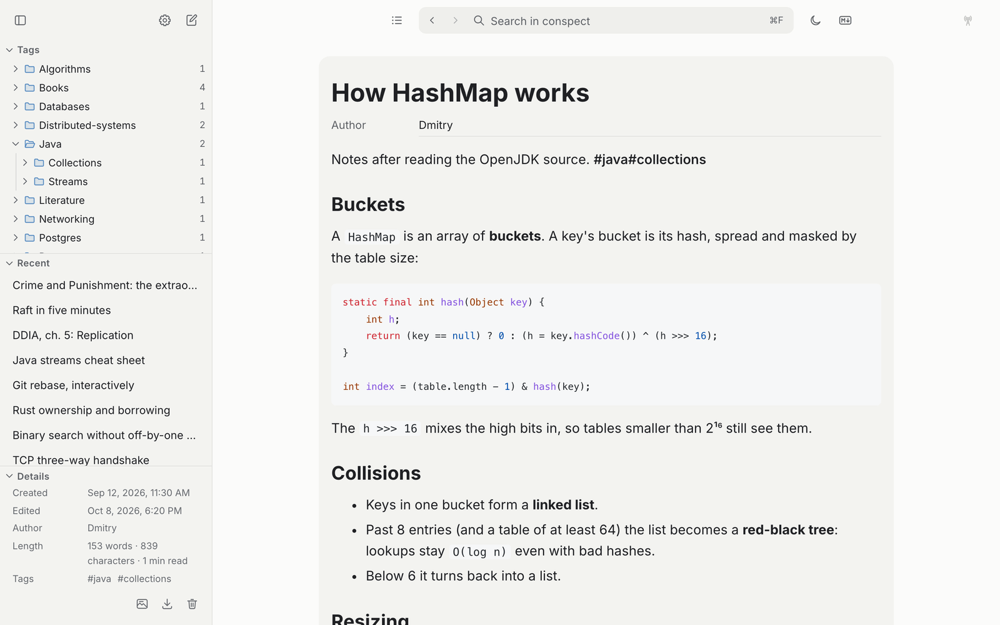
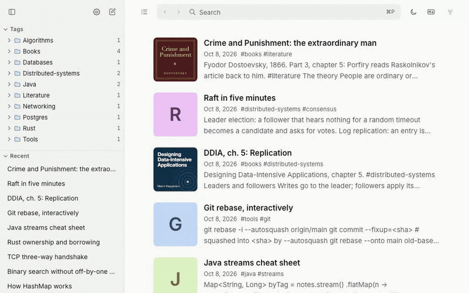
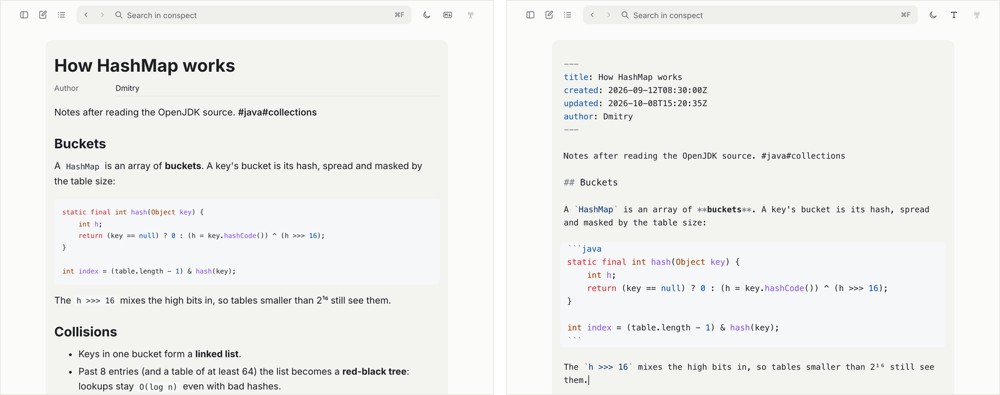
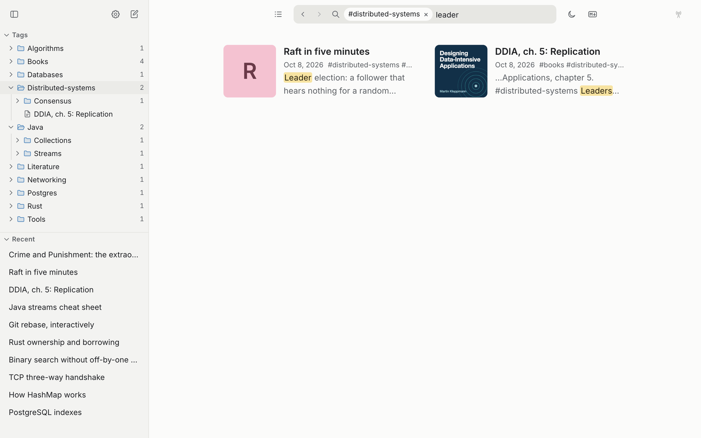
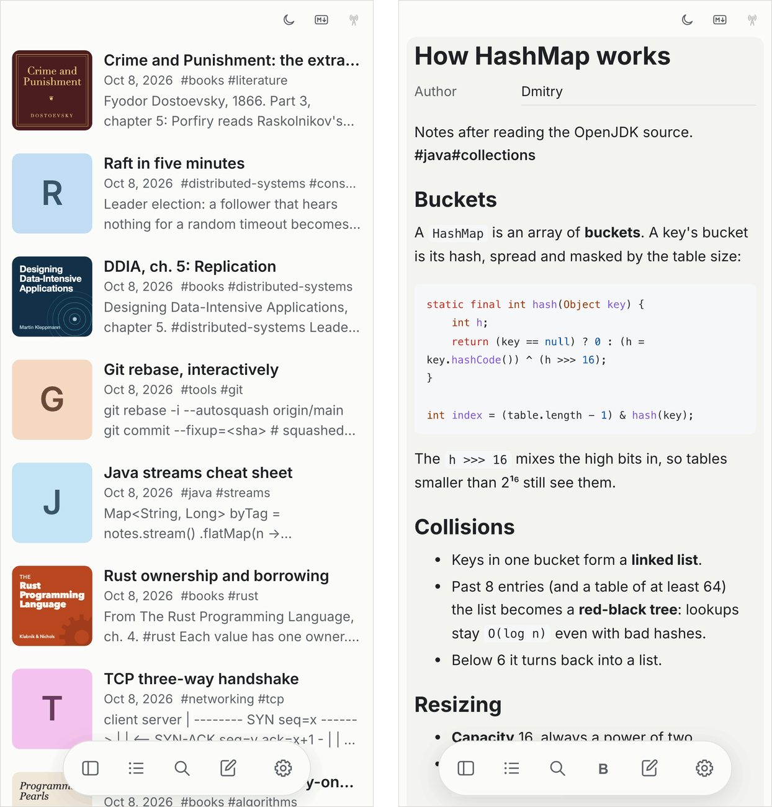

# Konspecter

**A personal memory for the things you've learned.**

> **Learn. Save. Return.**

Konspecter is a **local-first knowledge base for your own conspects** — notes about books, technologies, algorithms, tools, courses, and anything else you want to understand and remember.

Every conspect is a plain **Markdown file**. Everything else — tags, search indexes, reading positions, and other metadata — is derived from your content and can be rebuilt.

[Website](https://konspecter.ru) · [Documentation](docs/) · [Releases](https://github.com/konspecter/konspecter/releases) · [Issues](https://github.com/konspecter/konspecter/issues)



---

## Why Konspecter?

Information is everywhere. The harder problem is often remembering **what you already learned** and quickly recovering the context you had when you learned it.

A conspect is not just a note. It is a pointer back to your own understanding:

```text
read → understand → write down → forget details
                         ↓
                  encounter a problem
                         ↓
                  find your conspect
                         ↓
               recover your understanding
                         ↓
                      apply it
```

Konspecter is built around this workflow.

It is **not** a Notion clone, a generic note-taking app, or a cloud-first document editor.

> You don't have to remember everything.
> You just need to be able to recover your own understanding when you need it.

---

## See it in action



The core workflow:

**Learn → write down → forget → search → return → apply.**

---

## Features

### Markdown-native

Every conspect is ordinary Markdown.

- Frontmatter
- GitHub-flavored Markdown
- Syntax highlighting
- Raw HTML with sanitization
- Import and export of `.md` files
- Import folders and ZIP archives

Your knowledge stays in a format that doesn't belong to Konspecter.

### Local-first

Your library lives on your device and works offline.

- IndexedDB in the web app
- Installable PWA
- No cloud account required for local use
- Full-text search works offline
- Reading position is remembered
- Data can be exported at any time

The hosted service is optional.

### Two editors

Konspecter provides two ways to work with the same content:

- a distraction-free, Telegraph-like editor;
- a Markdown source editor powered by CodeMirror.

Switching between them does not change what your conspect means.



### Tags and search

Tags live directly in your text:

```text
#java
#java#collections
```

Konspecter builds a tag tree from them and lets you combine tags with full-text search.

For example:

```text
hashmap #java
```

Search is local and works without an internet connection.



### Desktop files

The desktop application uses a real folder of Markdown files:

```text
~/Konspecter/
├── distributed-systems.md
├── java-collections.md
├── postgres.md
└── ...
```

The files can be opened and managed alongside the tools you already use:

- VS Code
- Vim
- Git
- other Markdown tools

Konspecter should fit into your workflow, not lock you into its own database format.

### Mobile

Konspecter runs on Android through Capacitor.

The same knowledge base can travel with you while remaining local-first.

<p align="center">
  
</p>

---

## Sync

Konspecter can synchronize your library through a Konspecter Sync Server.

Sync is **optional**. Your local library does not depend on it.

Conspects are end-to-end encrypted before they leave your device. When the same conspect changes on two devices, the later edit wins, and an edit always beats a deletion, so one conspect stays one conspect. See [Sync](docs/architecture/sync.md) for the details.

### Self-hosting

The Sync Server is open source and can be self-hosted, free of charge. Each release publishes images for amd64 and arm64: the API, the account site and the web app, run with Docker Compose behind Caddy, which gets HTTPS certificates by itself.

You need a Linux host with Docker, two DNS names pointing at it (one for the site and the API, one for the web app) and ports 80 and 443 open.

Download `konspecter-deploy-vX.Y.Z.tar.gz` from the [latest release](https://github.com/konspecter/konspecter/releases), then:

```sh
tar -xzf konspecter-deploy-vX.Y.Z.tar.gz && cd konspecter-deploy-vX.Y.Z
cp .env.example .env   # fill in the addresses, a database password and email
docker compose up -d
```

Open your site to create an account. Then, in the app, enter the site's URL under **Settings → Sync** and sign in with the browser, or scan the QR code in the site's settings.

See the [self-hosting guide](docs/self-hosting.md) for the settings, a private server, upgrades and backups.

---

## Hosted Sync

Konspecter may also provide a hosted Sync service for people who don't want to operate their own server.

The principle is simple:

> **You don't pay for access to your own knowledge.**
>
> You pay for infrastructure that synchronizes it.

Local use remains independent of the hosted service.

If a hosted subscription expires:

- your local library remains available;
- your Markdown files remain yours;
- local decryption continues to work;
- export continues to work;
- only hosted synchronization stops.

Self-hosting remains an option.

[Learn more about Konspecter Sync →](https://konspecter.ru)

---

## Platforms

| Platform                | Status    |
| ----------------------- | --------- |
| Web / PWA               | Available |
| macOS                   | Available |
| Windows                 | Available |
| Linux                   | Available |
| Android                 | Available |
| Self-hosted Sync Server | Available |

[Download the latest release →](https://github.com/konspecter/konspecter/releases)

---

## Quick start

### Web

Open the web application and install it from your browser.

**Web app:** https://app.konspecter.ru

After the first visit, the application continues to work offline.

### Desktop

Download the latest release for your platform:

- [macOS](https://github.com/konspecter/konspecter/releases)
- [Windows](https://github.com/konspecter/konspecter/releases)
- [Linux](https://github.com/konspecter/konspecter/releases)

Conspects are stored in:

```text
~/Konspecter
```

**Settings → Library → Change folder…** lets you choose another folder.

### Android

Download the APK from the [latest release](https://github.com/konspecter/konspecter/releases).

---

## Keyboard shortcuts

Konspecter is designed to be fast to use from the keyboard.

On macOS, use `⌘`; elsewhere, use `Ctrl`.

| Shortcut        | Action         |
| --------------- | -------------- |
| `⌘P` / `Ctrl+P` | Search         |
| `Esc`           | All conspects  |
| `⌘N` / `Ctrl+N` | New conspect   |
| `⌘,` / `Ctrl+,` | Settings       |
| `⌘S` / `Ctrl+S` | Save now       |
| `/`             | Search         |
| `n`             | New conspect   |
| `?`             | Show shortcuts |

Outside text fields, `/`, `n` and `?` are available as quick shortcuts.

---

## Development

### Requirements

- Node.js ≥ 22.22
- pnpm 10
- Go 1.27
- Rust via `rustup` for the desktop app
- JDK 21 and Android SDK for Android development

Install dependencies:

```sh
pnpm install
```

Run the web application:

```sh
pnpm dev
```

Run all checks:

```sh
pnpm check
```

Run end-to-end tests:

```sh
pnpm e2e
```

Run server tests:

```sh
cd apps/server
go test ./...
```

Run the desktop application:

```sh
pnpm --filter @konspecter/desktop dev
```

Build an Android debug APK:

```sh
pnpm --filter @konspecter/mobile android:debug
```

---

## Android debugging

Connect a device with USB debugging enabled:

```sh
adb devices
```

Build the debug APK:

```sh
pnpm --filter @konspecter/mobile android:debug
```

Install it:

```sh
adb install -r apps/mobile/android/app/build/outputs/apk/debug/app-debug.apk
```

Start the application:

```sh
adb shell am start -n app.konspecter.mobile/.MainActivity
```

For WebView debugging, open `chrome://inspect` in desktop Chrome and inspect the Konspecter WebView.

Debug builds expose the WebView for inspection; release builds do not.

To inspect application logs:

```sh
adb logcat -s Capacitor/Console
```

---

## Documentation

- [Architecture](docs/architecture/overview.md)
- [Architecture decisions](docs/architecture/decisions/)
- [Testing](docs/testing.md)
- [Performance](docs/performance.md)
- [Security](docs/security.md)
- [Self-hosting](docs/self-hosting.md)
- [Releasing](docs/release.md)
- [License policy](docs/license-policy.md)
- [Changelog](CHANGELOG.md)
- [Contributing](AGENTS.md)

---

## Project structure

Konspecter is a monorepo containing the applications, server, and shared packages.

```text
apps/
├── web/
├── site/
├── desktop/
├── mobile/
└── server/

packages/
└── ...
```

The web, desktop, mobile applications and shared packages are MIT licensed.

The Sync Server is licensed under **GNU AGPL v3**.

See the individual `LICENSE` files for the exact terms.

---

## Contributing

Konspecter is open source and contributions are welcome.

Before opening a pull request, please read:

- [Working rules, commands and conventions](AGENTS.md)
- [Architecture](docs/architecture/overview.md)
- [Security policy](docs/security.md)

For security issues, please follow the project's security policy rather than opening a public issue.

---

## License

Different parts of Konspecter use different licenses.

### Applications and shared packages

The web, account site, desktop and mobile applications, together with the shared packages, are licensed under the **MIT License**.

### Sync Server

The Sync Server is licensed under **GNU Affero General Public License v3 (AGPL-3.0-only)**.

See the `LICENSE` file in each component for the applicable terms.

---

## Status

Konspecter is under active development.

The core application is already usable; hosted Sync and the surrounding commercial infrastructure are being developed separately.
